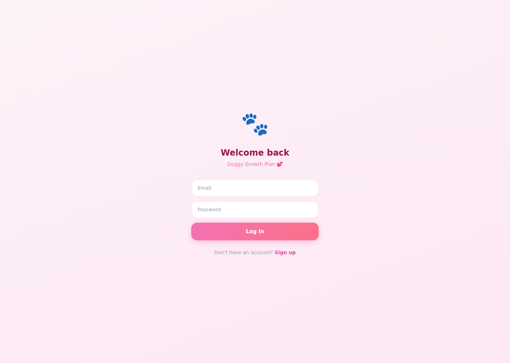
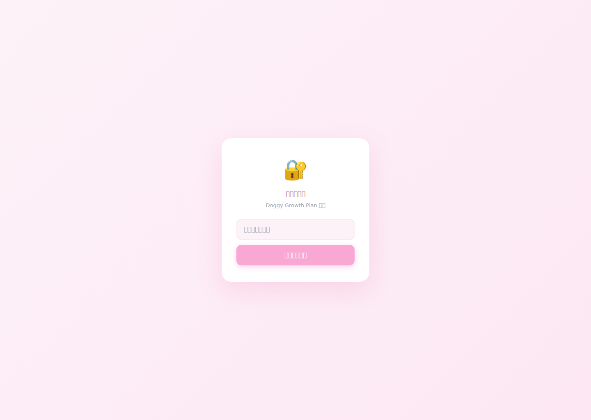

# GG Bond / Doggy Growth Plan — 新手完整上手 README

> 这份 README 是给**第一次接手这个项目的队友**看的。  
> 默认我们对 React、Firebase、前后端结构还不算熟也没关系，按这份文档一起看就行。

**English version (default):** `README.md`  
**中文版本：** `README_CN.md`

---

## 1. 先说最重要的：代码到底在哪？

当前这个 `master` 分支是从测试服务器推上来的快照，所以仓库根目录看起来会像服务器家目录。

### 真正的项目代码在这里：

```bash
apps/group-project-gg-bond-main/
```

以后如果我们要改功能，**就直接进这个目录看**。

项目核心目录：

```bash
apps/group-project-gg-bond-main/
├── frontend/   # React 前端
├── backend/    # Express 后端
└── README.md   # （如果后面补充了局部说明，会放这里）
```

---

## 2. 项目是做什么的？

这是一个**虚拟宠物成长平台**，主要功能包括：

- 创建宠物、养宠互动
- AI 问答
- 地图探索
- 社区发帖评论
- 宠物市场
- 领养页面
- 背包系统
- 排行榜
- 健康记录
- 成就系统
- 每日奖励
- 宠物训练
- 用户资料页
- 消息聊天
- 管理员后台

---

## 3. 技术栈（先有个大概概念）

### 前端
- React
- React Router
- Framer Motion
- react-hot-toast
- 自定义内联样式为主
- i18n 多语言（中文 / 英文 / 日文 / 毛利语）

### 后端
- Node.js
- Express
- Firebase Admin
- REST API

### 数据侧
- Firebase Auth：登录注册
- Firestore：用户、社区、消息等
- Firebase Storage：图片上传
- localStorage fallback：后端挂了时，部分功能本地兜底

---

## 4. 整体架构，先像地图一样记住

```text
用户打开页面
  ↓
frontend/src/App.js
  ↓
React Router 根据 URL 分发到各个页面
  ↓
页面从以下几层拿数据：
    1) context（全局登录/宠物状态）
    2) services/apiLayer.js（调用后端 API）
    3) services/firebase.js（直接走 Firebase）
    4) localStorage fallback（兜底）
  ↓
backend/src/index.js 挂载各个 /api/* 路由
```

---

## 5. 新手先看哪几个文件？

如果我们时间很少，先按这个顺序看：

### 必看 1：前端路由总入口
```bash
apps/group-project-gg-bond-main/frontend/src/App.js
```
看这个文件，你能知道：
- 一共有多少页面
- 每个页面的路由是什么
- 哪些页面需要登录
- 哪些是 tab 页，哪些不是

### 必看 2：13 个 tab 的定义
```bash
apps/group-project-gg-bond-main/frontend/src/components/Layout/Layout.js
```
看这个文件，你能知道：
- 底部 tab / 侧边栏 tab 是怎么定义的
- tab 的顺序
- tab 的图标和路由对应关系
- 手机 / 平板 / 桌面三套布局怎么切换

### 必看 3：登录状态
```bash
apps/group-project-gg-bond-main/frontend/src/context/AuthContext.js
```
看这个文件，你能知道：
- 登录注册怎么做
- Firebase 登录失败时，怎么切本地 fallback
- `currentUser` 从哪来

### 必看 4：宠物状态
```bash
apps/group-project-gg-bond-main/frontend/src/context/PetContext.js
```
看这个文件，你能知道：
- 当前宠物怎么读取
- 新宠物怎么创建
- 为什么有些按钮点了会更新宠物状态
- 没后端时为什么还能本地跑

### 必看 5：后端总入口
```bash
apps/group-project-gg-bond-main/backend/src/index.js
```
看这个文件，你能知道：
- 后端有哪些 API 模块
- 每个模块的挂载路径
- 比如 `/api/health`、`/api/training`、`/api/leaderboard` 等从哪进

---

## 6. 13 个 Tab 完整代码对照表（最重要）

> 下面这个表是给新手找代码用的。  
> 如果我们要改某个 tab，就从这里开始找。

| # | Tab 名称 | 路由 | 主页面文件 | 相关组件/逻辑 | 数据来源 |
|---|---|---|---|---|---|
| 1 | Home / 宠物主页 | `/` | `frontend/src/sandbox/PetPageV2.js` | `components/Pet/*`、`sandbox/statusDecayV2.js`、`context/PetContext.js` | Firestore / local pet fallback |
| 2 | AI | `/ai` | `frontend/src/pages/AIPage.js` | `context/AuthContext.js`、`context/PetContext.js` | Firebase + AI API |
| 3 | Map | `/map` | `frontend/src/pages/MapPage.js` | Google Maps、Firebase | Firebase / 地图 API |
| 4 | Marketplace | `/marketplace` | `frontend/src/pages/MarketplacePage.js` | `services/api.js`、Firebase Storage | API + Firebase |
| 5 | Community | `/community` | `frontend/src/pages/CommunityPage.js` | `components/Community/*`、PhotoUpload | Firestore |
| 6 | Profile | `/profile` | `frontend/src/pages/ProfilePage.js` | `components/Profile/*`、语言切换 | Auth + PetContext |
| 7 | Adopt | `/adopt` | `frontend/src/pages/AdoptPage.js` | 领养卡片 UI | 前端静态/本地数据 |
| 8 | Achievements | `/achievements` | `frontend/src/pages/AchievementsPage.js` | `services/apiLayer.js` → `AchievementsAPI` | `/api/achievements` + localStorage fallback |
| 9 | Inventory | `/inventory` | `frontend/src/pages/InventoryPage.js` | Pet item 使用逻辑 | `/api/inventory` + 本地状态 |
| 10 | Leaderboard | `/leaderboard` | `frontend/src/pages/LeaderboardPage.js` | `LeaderboardAPI` | `/api/leaderboard` |
| 11 | Health | `/health` | `frontend/src/pages/HealthRecordsPage.js` | `HealthAPI` | `/api/health` + localStorage fallback |
| 12 | Rewards | `/rewards` | `frontend/src/pages/DailyRewardsPage.js` | `RewardsAPI` | `/api/rewards` + localStorage fallback |
| 13 | Training | `/training` | `frontend/src/pages/PetTrainingPage.js` | `TrainingAPI` | `/api/training` + localStorage fallback |

---

## 7. 另外两个“不是 tab，但很重要”的页面

### Messages
- 路由：`/messages`
- 文件：`frontend/src/pages/MessagesPage.js`
- 用途：聊天会话列表

### Chat
- 路由：`/messages/:conversationId`
- 文件：`frontend/src/pages/ChatPage.js`
- 用途：具体聊天窗口

---

## 8. 每个 tab 更详细的“改代码入口”

---

### 1) Home / 宠物主页
**主文件：**
```bash
frontend/src/sandbox/PetPageV2.js
```

**你会在这里改什么：**
- 宠物主页布局
- 创建宠物弹窗显示逻辑
- 喂食 / 喝水 / 洗澡 / 散步 等动作
- 空状态（新用户没宠物时）
- 桌面/平板/手机三种显示

**相关文件：**
```bash
frontend/src/components/Pet/CreatePetModal.js
frontend/src/components/Pet/ActionRing.js
frontend/src/components/Pet/StatusRow.js
frontend/src/components/Pet/DogCharacter.js
frontend/src/context/PetContext.js
frontend/src/sandbox/statusDecayV2.js
```

**怎么理解：**
- `PetPageV2.js` = 页面本体
- `PetContext.js` = 当前宠物数据来源
- `statusDecayV2.js` = 宠物状态衰减算法
- `CreatePetModal.js` = 新建宠物弹窗

---

### 2) AI
**主文件：**
```bash
frontend/src/pages/AIPage.js
```

**你会在这里改什么：**
- AI 对话界面
- 发送问题
- 把宠物信息拼进 prompt
- 显示 AI 返回结果

**相关文件：**
```bash
backend/src/routes/ai.js
frontend/src/context/AuthContext.js
frontend/src/context/PetContext.js
frontend/src/services/firebase.js
```

**新手理解：**
前端收集用户问题 + 当前宠物状态，然后发给 AI 接口，后端/服务端再去请求模型。

---

### 3) Map
**主文件：**
```bash
frontend/src/pages/MapPage.js
```

**相关后端：**
```bash
backend/src/routes/map.js
```

**你会在这里改什么：**
- 地图中心点
- 标记点样式
- 周边宠物/用户展示
- Google Maps 加载逻辑

---

### 4) Marketplace
**主文件：**
```bash
frontend/src/pages/MarketplacePage.js
```

**相关文件：**
```bash
frontend/src/services/api.js
backend/src/routes/marketplace.js
frontend/src/services/firebase.js
frontend/src/services/storage.js
```

**你会在这里改什么：**
- 商品列表
- 商品详情
- 发布商品
- 上传商品图片
- 搜索 / 分类 / 过滤 / sale tab

**新手理解：**
这个页面功能比较大，优先看页面顶部 state，然后看数据加载函数，再看发布表单。

---

### 5) Community
**主文件：**
```bash
frontend/src/pages/CommunityPage.js
```

**相关文件：**
```bash
frontend/src/components/Community/CommentList.js
frontend/src/components/Community/MyMatchCard.js
frontend/src/components/PhotoUpload.js
backend/src/routes/community.js
```

**你会在这里改什么：**
- 发帖
- 评论
- 上传图片
- 匹配卡片
- 帖子展示布局

---

### 6) Profile
**主文件：**
```bash
frontend/src/pages/ProfilePage.js
```

**相关文件：**
```bash
frontend/src/components/Profile/PetEditCard.js
frontend/src/components/Profile/AchievementWall.js
frontend/src/context/AuthContext.js
frontend/src/context/PetContext.js
frontend/src/i18n/I18nContext.js
```

**你会在这里改什么：**
- 用户资料展示
- 宠物资料编辑
- 头像修改
- 语言切换
- 成就墙

---

### 7) Adopt
**主文件：**
```bash
frontend/src/pages/AdoptPage.js
```

**你会在这里改什么：**
- 领养卡片 UI
- 领养信息展示
- 领养筛选

**说明：**
这个页面相对独立，适合新手先练手改样式。

---

### 8) Achievements
**主文件：**
```bash
frontend/src/pages/AchievementsPage.js
```

**相关文件：**
```bash
frontend/src/services/apiLayer.js
backend/src/routes/achievements.js
frontend/src/services/achievementsService.js
```

**你会在这里改什么：**
- 成就列表
- 解锁条件
- 进度条
- 稀有度显示

**新手理解：**
前端页面主要负责显示，真正的数据读写入口在 `AchievementsAPI`。

---

### 9) Inventory
**主文件：**
```bash
frontend/src/pages/InventoryPage.js
```

**相关文件：**
```bash
backend/src/routes/inventory.js
frontend/src/context/PetContext.js
```

**你会在这里改什么：**
- 背包物品列表
- 使用物品
- 物品分类
- 使用后如何影响宠物状态

---

### 10) Leaderboard
**主文件：**
```bash
frontend/src/pages/LeaderboardPage.js
```

**相关文件：**
```bash
frontend/src/services/apiLayer.js
backend/src/routes/leaderboard.js
```

**你会在这里改什么：**
- 排行榜 tab
- 排名规则
- 用户显示文案
- 多语言文案

---

### 11) Health
**主文件：**
```bash
frontend/src/pages/HealthRecordsPage.js
```

**相关文件：**
```bash
frontend/src/services/apiLayer.js
backend/src/routes/health.js
```

**你会在这里改什么：**
- 健康记录列表
- 新增记录弹窗
- 删除记录
- 疫苗/检查/药物分类

---

### 12) Rewards
**主文件：**
```bash
frontend/src/pages/DailyRewardsPage.js
```

**相关文件：**
```bash
frontend/src/services/apiLayer.js
backend/src/routes/rewards.js
```

**你会在这里改什么：**
- 每日签到
- 连续签到天数
- 奖励 UI
- 今日是否已领取

---

### 13) Training
**主文件：**
```bash
frontend/src/pages/PetTrainingPage.js
```

**相关文件：**
```bash
frontend/src/services/apiLayer.js
backend/src/routes/training.js
```

**你会在这里改什么：**
- 宠物技能训练
- 技能等级
- 训练点数
- 训练历史
- streak（连续训练）

---

## 9. “一个功能到底前后端分别在哪”——超实用对照

### 登录 / 注册
- 前端页面：
  - `frontend/src/pages/LoginPage.js`
  - `frontend/src/pages/RegisterPage.js`
- 登录逻辑：
  - `frontend/src/context/AuthContext.js`
- Firebase 初始化：
  - `frontend/src/services/firebase.js`

### 宠物创建 / 宠物主页
- 页面：`frontend/src/sandbox/PetPageV2.js`
- 弹窗：`frontend/src/components/Pet/CreatePetModal.js`
- 数据：`frontend/src/context/PetContext.js`
- 状态算法：`frontend/src/sandbox/statusDecayV2.js`
- 后端：`backend/src/routes/pet.js`

### 发帖 / 评论 / 社区
- 页面：`frontend/src/pages/CommunityPage.js`
- 评论组件：`frontend/src/components/Community/CommentList.js`
- 后端：`backend/src/routes/community.js`

### 地图
- 页面：`frontend/src/pages/MapPage.js`
- 后端：`backend/src/routes/map.js`

### 市场
- 页面：`frontend/src/pages/MarketplacePage.js`
- API：`frontend/src/services/api.js`
- 后端：`backend/src/routes/marketplace.js`

### 背包 / 健康 / 成就 / 奖励 / 训练 / 排行榜
- 这些大多统一走：
  - `frontend/src/services/apiLayer.js`
- 后端分别对应：
  - `backend/src/routes/inventory.js`
  - `backend/src/routes/health.js`
  - `backend/src/routes/achievements.js`
  - `backend/src/routes/rewards.js`
  - `backend/src/routes/training.js`
  - `backend/src/routes/leaderboard.js`

---

## 10. 如果你只想“改某个 tab 的 UI”，怎么做？

### 最快方法
1. 打开 `frontend/src/components/Layout/Layout.js`
2. 找到 tab 对应的路由
3. 去 `frontend/src/App.js` 找对应 page 文件
4. 进入对应 `frontend/src/pages/xxxPage.js`
5. 直接改 JSX / 样式

### 例子：我要改排行榜页面
1. `Layout.js` 看到 leaderboard → `/leaderboard`
2. `App.js` 看到 `/leaderboard` → `LeaderboardPage`
3. 打开：
```bash
frontend/src/pages/LeaderboardPage.js
```
4. 开始改页面

---

## 11. 如果你要“改功能逻辑”，怎么找？

### 看 imports（最简单）
比如你打开一个 page 文件，先看顶部 `import`：

- import 了 `context/...` → 说明数据来自全局状态
- import 了 `services/apiLayer` → 说明走后端 API
- import 了 `services/firebase` → 说明直接打 Firebase
- import 了 `components/...` → 说明 UI 是拆出来的组件

这一步对新手非常有用。

---

## 12. 后端 API 总表

后端总入口：
```bash
backend/src/index.js
```

挂载的 API：

| 路由前缀 | 文件 |
|---|---|
| `/api/pet` | `backend/src/routes/pet.js` |
| `/api/activities` | `backend/src/routes/activities.js` |
| `/api/ai` | `backend/src/routes/ai.js` |
| `/api/community` | `backend/src/routes/community.js` |
| `/api/map` | `backend/src/routes/map.js` |
| `/api/marketplace` | `backend/src/routes/marketplace.js` |
| `/api/inventory` | `backend/src/routes/inventory.js` |
| `/api/admin` | `backend/src/routes/admin.js` |
| `/api/achievements` | `backend/src/routes/achievements.js` |
| `/api/training` | `backend/src/routes/training.js` |
| `/api/rewards` | `backend/src/routes/rewards.js` |
| `/api/health` | `backend/src/routes/health.js` |
| `/api/leaderboard` | `backend/src/routes/leaderboard.js` |
| `/health` | 健康检查 |

---

## 13. 前端常用目录说明

```bash
frontend/src/
├── pages/         # 页面级组件（一个路由一个页面）
├── components/    # 可复用组件
├── context/       # 全局状态（登录、宠物）
├── services/      # 接口层 / Firebase / fallback
├── sandbox/       # 实验页或复杂版本（当前首页 V2 在这里）
├── i18n/          # 多语言字典和切换逻辑
├── data/          # 静态数据（比如 breeds）
└── utils/         # 工具函数
```

---

## 14. 推荐新手的阅读顺序

### 第 1 轮（只看结构）
1. `frontend/src/App.js`
2. `frontend/src/components/Layout/Layout.js`
3. `backend/src/index.js`

### 第 2 轮（看核心业务）
4. `frontend/src/context/AuthContext.js`
5. `frontend/src/context/PetContext.js`
6. `frontend/src/sandbox/PetPageV2.js`

### 第 3 轮（按你负责的 tab 看）
7. 找到你负责的 page 文件
8. 再看它 import 的 service / component / backend route

---

## 15. 推荐新手第一次改动做什么？

如果我们是第一次接手，建议按难度从低到高：

### 最容易
- 改 `AdoptPage.js` 的 UI
- 改 `ProfilePage.js` 的文字或布局
- 改某个 tab 的图标或文案（`Layout.js`）

### 中等
- 改 `LeaderboardPage.js` 的显示逻辑
- 改 `HealthRecordsPage.js` 的表单
- 改 `DailyRewardsPage.js` 的奖励展示

### 较复杂
- 改 `MarketplacePage.js`
- 改 `CommunityPage.js`
- 改 `PetPageV2.js`
- 改 AI / Firebase / Admin 相关逻辑

---

## 16. 最近修过的重要坑（接手前最好知道）

### 1) 新用户没有宠物时会白屏
修复点：
- `frontend/src/sandbox/PetPageV2.js`
- 原因：桌面/平板布局在 `pet` 为空时先读了 `pet.name`

### 2) 宠物创建按钮/空状态页有调试残留
修复点：
- `frontend/src/sandbox/PetPageV2.js`

### 3) 服务器回滚后浏览器缓存导致白屏
修复点：
- Nginx 缓存头（服务器配置）

---

## 17. 本地开发怎么跑

### 前端
```bash
cd apps/group-project-gg-bond-main/frontend
npm install
npm start
```

### 后端
```bash
cd apps/group-project-gg-bond-main/backend
npm install
npm start
```

默认后端：
- `http://localhost:5000`

健康检查：
```bash
curl http://localhost:5000/health
```

---

## 18. 测试服务器信息

- IP: `4.155.227.179`
- SSH: `destiny@4.155.227.179`
- 线上前端静态目录：`/var/www/gg-bond`
- 线上后端代码目录：
  ```bash
  /home/destiny/apps/group-project-gg-bond-main/backend
  ```
- 线上前端代码目录：
  ```bash
  /home/destiny/apps/group-project-gg-bond-main/frontend
  ```

---

## 19. 给队友的最后一句话

如果我们完全不知道从哪里下手，记住一句就够：

> **先看 `App.js` 找页面，再看 `Layout.js` 找 tab，再看对应 page 文件。**

如果还是迷路，就按这个链路找：

```text
Tab 名称
→ Layout.js
→ App.js route
→ pages/xxxPage.js
→ imports 里的 service/context/component
→ backend/src/routes/xxx.js
```

这条链基本能把 90% 的代码找到。

---

## 20. 团队信息

- Team: **GG Bond**
- 课程：CS732
- 项目：Virtual Pet Growth Platform
- 维护仓库：`kndhjk/doggy-growth-plan`
- 测试服版本：当前 `master` 已同步到测试服运行版本

如果后面你们要继续整理仓库，建议下一步做两件事：

1. 把真正项目根目录从 `apps/group-project-gg-bond-main/` 提到仓库根目录
2. 把服务器无关文件（如 `.bash_history`、`.npm/`、压缩包等）从仓库历史里清出去

这两个不影响现在开发，但会让仓库干净很多。

---

## 21. 队友第一次拉代码后，第一小时该做什么？

这是推荐的 **1 小时上手流程**。

### 第 0 步：确认你看的不是假根目录
仓库根目录里会有很多服务器痕迹文件，所以一定先进入：

```bash
cd apps/group-project-gg-bond-main
```

### 第 1 步：只看结构，不要急着改
按这个顺序打开文件：

1. `frontend/src/App.js`
2. `frontend/src/components/Layout/Layout.js`
3. `frontend/src/context/AuthContext.js`
4. `frontend/src/context/PetContext.js`
5. `backend/src/index.js`

### 第 2 步：选一个你负责的 tab
举例：
- 你负责排行榜 → 看 `LeaderboardPage.js`
- 你负责健康页 → 看 `HealthRecordsPage.js`
- 你负责宠物主页 → 看 `PetPageV2.js`

### 第 3 步：只改文案或颜色，先完成一次最小提交
不要一上来改大逻辑。第一次建议只做：
- 改标题
- 改按钮颜色
- 改列表文案
- 改一个小卡片布局

这样最不容易炸。

---

## 22. 环境变量到底是干嘛的？

### 前端环境变量
文件：
```bash
apps/group-project-gg-bond-main/frontend/.env.production
```

常见变量：
- `REACT_APP_API_URL`：前端请求后端 API 的地址
- Firebase 相关 key
- Google Maps key
- 可能还有 AI key / Gemini key（按页面实际使用）

### 后端环境变量
文件：
```bash
apps/group-project-gg-bond-main/backend/.env
```

常见变量：
- `PORT=5000`
- `FRONTEND_URL=...`
- Firebase Admin 相关配置
- 其他第三方服务 key

### 新手要记住
- **前端环境变量变了，通常要重新 build**
- **后端环境变量变了，通常要重启 node 服务**

---

## 23. 前端页面是怎么串起来的？

你可以把前端理解成 4 层：

### 第 1 层：路由层
文件：
```bash
frontend/src/App.js
```
作用：
- URL 对应哪个页面
- 哪个页面需要登录后才能看

### 第 2 层：布局层
文件：
```bash
frontend/src/components/Layout/Layout.js
```
作用：
- 底部 tab / 左侧边栏
- 手机、平板、桌面三种布局切换

### 第 3 层：页面层
文件夹：
```bash
frontend/src/pages/
frontend/src/sandbox/
```
作用：
- 真正的业务页面
- 一般每个 tab 对应一个 page

### 第 4 层：数据层
文件夹：
```bash
frontend/src/context/
frontend/src/services/
```
作用：
- 登录状态
- 宠物状态
- API 请求
- Firebase 连接
- 本地 fallback

---

## 24. 后端是怎么串起来的？

你可以把后端理解成 3 层：

### 第 1 层：总入口
```bash
backend/src/index.js
```
作用：
- 启动 express
- 挂中间件
- 把 `/api/*` 路由接起来

### 第 2 层：route 层
```bash
backend/src/routes/*.js
```
作用：
- 按功能拆 API
- 一个 route 文件处理一类业务

### 第 3 层：service / middleware 层
```bash
backend/src/services/
backend/src/middleware/
```
作用：
- Firebase Admin 初始化
- 鉴权
- 参数校验
- 公共逻辑复用

---

## 25. 常见开发任务，应该改哪些文件？

### 场景 A：我只想改页面文字
一般改：
- `frontend/src/pages/xxxPage.js`
- 如果是多语言文案，再去：
  - `frontend/src/i18n/locales/zh.js`
  - `frontend/src/i18n/locales/en.js`
  - `frontend/src/i18n/locales/ja.js`
  - `frontend/src/i18n/locales/mi.js`

### 场景 B：我只想改 tab 顺序或图标
改：
```bash
frontend/src/components/Layout/Layout.js
```

### 场景 C：我想加一个新的按钮，点了要调后端
通常会改：
1. 页面文件（加按钮）
2. `frontend/src/services/apiLayer.js` 或 `services/api.js`（加请求方法）
3. `backend/src/routes/xxx.js`（加 API）

### 场景 D：我想改登录逻辑
改：
- `frontend/src/context/AuthContext.js`
- `frontend/src/services/firebase.js`

### 场景 E：我想改宠物状态怎么衰减
改：
- `frontend/src/sandbox/statusDecayV2.js`
- 有时候还要看 `PetContext.js`

---

## 26. 如果我要“新增一个 tab”，完整流程是什么？

这是非常常见的需求，流程如下：

### 第 1 步：新建页面文件
例如新建：
```bash
frontend/src/pages/MyNewTabPage.js
```

### 第 2 步：在 `App.js` 里注册路由
例如：
```jsx
<Route path="mytab" element={<MyNewTabPage />} />
```

### 第 3 步：在 `Layout.js` 的 `TABS` 数组里加一项
例如：
```js
{ to:'/mytab', icon:'🧪', iconImg:null, i18nKey:'nav.mytab' }
```

### 第 4 步：补多语言 key
例如去 locale 文件加：
```js
'nav.mytab': 'My Tab'
```

### 第 5 步：如果需要后端，再补 API
例如：
- 前端：`services/apiLayer.js`
- 后端：`backend/src/routes/mytab.js`
- 总入口：`backend/src/index.js`

---

## 27. 多语言（i18n）怎么改，才不会漏？

这个项目是多语言项目，**不要随便把中文硬编码到页面里**。

### 正确做法
1. 页面里用：
```js
const { t } = useI18n();
```
2. 页面显示文字时写：
```jsx
{t('nav.home')}
```
3. 去对应 locale 文件补 key

### locale 文件位置
```bash
frontend/src/i18n/
```

### 新手最容易犯的错
- 只改了中文，没改英文/日文/毛利语
- 页面里直接写死中文
- 改完 key 但没同步到其他语言文件

### 最稳妥做法
每次加新文案时，**四个语言文件一起补**，不要想着“后面再补”。

---

## 28. 数据优先从哪里来？一张脑图记住

不同页面拿数据的方式并不完全一样，大体分 4 种：

### 1) Context
典型：
- `AuthContext`
- `PetContext`

适合：
- 当前登录用户
- 当前宠物
- 全局共享状态

### 2) `services/apiLayer.js`
典型：
- Achievements
- Training
- Rewards
- Health
- Leaderboard

适合：
- 标准 REST API 数据
- 有本地 fallback 的页面

### 3) `services/firebase.js`
典型：
- 社区
- 消息
- 登录认证
- 地图的一部分数据

适合：
- 直接 Firestore/Firebase Auth 交互

### 4) localStorage fallback
典型：
- 本地宠物
- 本地成就进度
- 本地 health records
- 本地 rewards / training

适合：
- 后端挂了时还能演示
- 开发阶段快速兜底

---

## 29. 最常见的报错，应该先查哪里？

### 白屏 / 页面空白
先查：
1. 浏览器 console
2. 当前 page 文件
3. 页面是否提前读取了 `null` 数据（比如 `pet.name`）
4. 路由有没有写错

### 按钮点了没反应
先查：
1. 按钮 `onClick` 是否绑上
2. 调用的函数是否真的执行
3. API 是否报错
4. toast / 状态更新是否被吞掉

### 数据保存失败
先查：
1. 前端调用哪个 service
2. service 走的是 API 还是 Firebase
3. 后端 route 是否存在
4. 环境变量是否缺失

### 登录失效 / 用户状态异常
先查：
1. `frontend/src/context/AuthContext.js`
2. `frontend/src/services/firebase.js`
3. local fallback 是否接管了

### build 成功但线上没变化
先查：
1. 有没有重新把 `frontend/build/` 部署到 nginx
2. 浏览器缓存
3. `REACT_APP_API_URL` 是否正确

---

## 30. 新手最容易踩的 10 个坑

1. **看错目录**：改了仓库根目录，没改 `apps/group-project-gg-bond-main/`
2. **只改页面，不改数据层**：按钮出来了，但根本没请求
3. **只改中文，不补 i18n**
4. **把 context 当普通 local state 用**
5. **忘记后端 route 还要在 `backend/src/index.js` 挂载**
6. **改了环境变量但没重启 / 没重新 build**
7. **以为页面白屏是样式问题，其实是 JS 报错**
8. **直接在复杂页面大改，不先做小提交**
9. **只看 page，不看顶部 import，结果找不到数据来源**
10. **线上缓存没清，误以为代码没生效**

---

## 31. 建议的协作分工（很适合你们这种队友水平不均的组）

### 新手适合负责
- Adopt
- Profile
- Leaderboard
- Health 的 UI 部分
- Rewards 的展示部分
- README / 文档

### 中级适合负责
- Marketplace
- Community
- Inventory
- Achievements
- Training

### 较熟的人适合负责
- Auth
- PetContext / PetPageV2
- AI
- Firebase 数据结构
- Admin
- 部署

这样分工最稳。

---

## 32. 推荐提交流程（别把仓库搞炸）

每次改动尽量按这个流程：

1. 先 pull / fetch 最新代码
2. 只改一个功能点
3. 本地跑起来确认页面没白屏
4. 如果有后端，顺手测一下 `/health`
5. commit message 写清楚改了什么

示例：
```bash
git add .
git commit -m "fix: leaderboard i18n labels"
git push origin master
```

如果你改的是大功能，建议不要一把梭，拆成多个 commit。

---

## 33. README 之后还建议补什么文档？

如果你们后面还要继续交接，我建议继续补这几个文件：

### `CONTRIBUTING.md`
写清楚：
- 队友怎么提交流程
- 命名规范
- 改 tab 时从哪里找代码

### `DEPLOYMENT.md`
写清楚：
- 前端怎么 build
- 怎么发到测试服务器
- 后端怎么重启
- 回滚怎么做

### `ARCHITECTURE.md`
写清楚：
- Firebase 数据结构
- Context / API / fallback 的关系
- 各模块之间依赖

---

## 34. 真正接手时，可以直接照抄的排查顺序

### 我想改一个 tab，但完全不知道从哪里开始
```text
1. 看 Layout.js 里的 TABS
2. 找到 route
3. 去 App.js 看 route 对应哪个 page
4. 打开 page 文件
5. 看 import
6. 顺着 import 找 service/context/component
7. 如果有后端，再找 backend/src/routes/*.js
```

### 我改完了，但页面没生效
```text
1. 看你改的是不是 apps/group-project-gg-bond-main/ 里的文件
2. 看有没有 build
3. 看有没有部署到 /var/www/gg-bond
4. 看浏览器有没有缓存
```

### 我加了 API，但前端报 404
```text
1. route 文件有没有创建
2. backend/src/index.js 有没有 app.use 挂载
3. path 前缀有没有写对
4. 后端服务有没有重启
```

---

## 35. 最后的结论（给真的很新的队友）

如果我们读完前面内容还是怕，那至少记住下面这三句：

### 句子 1
> **所有真正项目代码都在 `apps/group-project-gg-bond-main/`。**

### 句子 2
> **找页面入口看 `App.js`，找 tab 看 `Layout.js`。**

### 句子 3
> **找数据来源先看 imports，再决定去 context、services 还是 backend routes。**

只要记住这三句，基本就不会完全迷路。

---

## 36. 部署到底怎么做？给没部署过的人看

这个项目现在有两套“运行思路”，不要混：

### 思路 A：本地开发
你在自己电脑上跑：
- 前端：React dev server
- 后端：Node / Express

### 思路 B：测试服务器部署
你把前端 build 完，放到 nginx；后端用 node 在服务器上跑。

### 当前测试服务器部署结构
- 前端静态文件：`/var/www/gg-bond`
- 后端运行端口：`5000`
- nginx：负责把 `/` 指向前端，把 `/api/` 反代到 `127.0.0.1:5000`

### 一句话理解
```text
浏览器
→ nginx
→ /            读前端静态文件
→ /api/*       转发给 node 后端
```

---

## 37. 测试服务器上一次完整部署，实际做了什么？

如果你要把改动重新发到测试服务器，核心是这几步：

### 前端
```bash
cd apps/group-project-gg-bond-main/frontend
npm install
CI=true npm run build
```

生成结果在：
```bash
frontend/build/
```

然后把它同步到：
```bash
/var/www/gg-bond
```

### 后端
```bash
cd apps/group-project-gg-bond-main/backend
npm install
npm start
```

后端监听：
```bash
http://127.0.0.1:5000
```

### 最后检查
```bash
curl http://127.0.0.1:5000/health
curl -I http://127.0.0.1/
```

---

## 38. 为什么仓库里会有 `frontend/build/`？

正常 React 项目很多时候不会把 build 产物提交到 git。

但这个仓库当前 `master` 是从测试服务器环境推上来的，所以：
- 有服务器目录痕迹
- 有 `frontend/build/`
- 有一些不够干净的历史结构

### 新手要记住
- **业务源码主要看 `src/`**
- `build/` 是编译后产物，不是你平时主要修改的地方
- 除非你在做部署快照，否则尽量不要手改 build 文件

---

## 39. 后端每个 route 大概负责什么？

> 这个表的用途是：当前端同学看到 `/api/xxx` 时，知道该去哪找。

| route 文件 | 负责什么 |
|---|---|
| `routes/pet.js` | 宠物创建、读取、更新，宠物核心数据 |
| `routes/activities.js` | 宠物活动记录（喂食、喝水、洗澡等） |
| `routes/ai.js` | AI 对话 / AI 相关请求 |
| `routes/community.js` | 社区帖子、评论、互动 |
| `routes/map.js` | 地图相关数据 |
| `routes/marketplace.js` | 商品、交易市场、发布内容 |
| `routes/inventory.js` | 背包物品、使用道具 |
| `routes/achievements.js` | 成就进度、解锁状态 |
| `routes/training.js` | 训练技能、训练记录、训练点数 |
| `routes/rewards.js` | 每日奖励 / 签到 |
| `routes/health.js` | 健康记录 |
| `routes/leaderboard.js` | 排行榜数据 |
| `routes/admin.js` | 管理员后台操作 |

### 看到 API 时怎么反推？
比如你在前端看到：
```js
fetch('/api/health')
```
那你直接去：
```bash
backend/src/routes/health.js
```

---

## 40. 前端 `services/` 目录怎么理解？

很多新手看到 `services/` 会慌，其实可以这么记：

### `services/firebase.js`
作用：
- 初始化 Firebase app
- 导出 `auth` / `db` / `storage`

### `services/api.js`
作用：
- 比较原始的 API 请求逻辑
- Marketplace 这类页面直接在用

### `services/apiLayer.js`
作用：
- 更像“按业务封装好的 API”
- 比如：
  - `AchievementsAPI`
  - `TrainingAPI`
  - `RewardsAPI`
  - `HealthAPI`
  - `LeaderboardAPI`

### `services/authFallback.js`
作用：
- Firebase 认证出问题时，本地兜底登录

### `services/petLocalStore.js`
作用：
- 宠物本地缓存
- 后端/Firestore 不可用时兜底

### `services/storage.js`
作用：
- 文件 / 图片上传相关封装

---

## 41. `context/` 和 `services/` 的区别是什么？

这是新手最容易混的点之一。

### `context/`
偏“当前页面/整个 app 正在用的状态”

例如：
- 当前登录用户是谁
- 当前宠物是谁

### `services/`
偏“拿数据 / 存数据 / 调接口的方法”

例如：
- 调 `/api/leaderboard`
- 初始化 Firebase
- 读写 localStorage

### 一句话记忆
> **context 是“状态容器”，services 是“拿状态/存状态的工具”。**

---

## 42. `pages/` 和 `components/` 的区别是什么？

### `pages/`
一个路由通常对应一个 page。

例如：
- `/leaderboard` → `LeaderboardPage.js`
- `/profile` → `ProfilePage.js`

### `components/`
页面里反复复用的小块 UI。

例如：
- 宠物卡片
- 评论列表
- 上传组件
- Layout
- ActionRing

### 一句话记忆
> **page 是整页，component 是零件。**

---

## 43. 如果队友说“这个功能到底有没有后端”，怎么判断？

看 page 顶部 import 基本就能猜到：

### 情况 1：import 了 `apiLayer` / `api`
说明大概率有后端接口。

### 情况 2：import 了 `firebase.js`
说明大概率直接走 Firebase。

### 情况 3：只用了 `useState` / 本地数组 / mock 数据
说明可能只是前端静态实现。

### 情况 4：代码里有 `localStorage`
说明可能有本地 fallback，甚至主要就是本地存储。

---

## 44. 这个项目为什么会出现“同一功能有两套数据源”？

因为它不是那种从一开始就非常干净、完全统一的数据架构。

当前项目里常见情况是：
- 正常情况：走 Firebase / 走后端 API
- 异常情况：走 local fallback
- 某些页面：直接前端 mock 数据

### 这不是 bug 吗？
不一定。

对课程项目来说，这种设计有一个现实好处：
> **就算后端挂了，演示还能继续。**

### 但新手要注意
你改功能时，一定要搞清楚：
- 你改的是“真实数据流”
- 还是只改了“fallback / mock 数据”

---

## 45. 一份给队友的“改功能前检查清单”

开始改之前，先问自己 8 个问题：

1. 我改的是哪个 tab / 页面？
2. 对应 page 文件是哪一个？
3. 数据来自 context、API、Firebase，还是 localStorage？
4. 有没有多语言文案需要一起改？
5. 有没有后端 route 也要改？
6. 改完需不需要 build？
7. 改完需不需要重启后端？
8. 这个改动会不会影响移动端布局？

这 8 个问题能帮你避开一大半低级坑。

---

## 46. 一份给 reviewer 的“看队友代码清单”

如果你在帮队友 review，可以按这个顺序扫：

### 页面层
- 有没有直接写死中文？
- 有没有空值判断？
- 手机上会不会炸布局？

### 数据层
- 有没有调用错 API？
- fallback 是否还能工作？
- 改动会不会影响已有 localStorage 数据？

### 后端层
- route 有没有挂到 `backend/src/index.js`？
- 参数是否校验？
- 报错是否返回清楚？

### 部署层
- 如果改了前端，build 是否同步？
- 如果改了环境变量，是否说明重启要求？

---

## 47. 如果后面要做仓库整理，推荐顺序是什么？

现在这个仓库能用，但结构不算理想。以后要整理，我建议按这个顺序：

### 第 1 步：把真正项目根目录提到仓库根
也就是把：
```bash
apps/group-project-gg-bond-main/
```
提到最外面。

### 第 2 步：把服务器杂项移出版本控制
例如：
- `.bash_history`
- `.npm/`
- 压缩包
- 临时日志

### 第 3 步：决定 build 是否继续提交
- 如果想保留部署快照，可以提交
- 如果想更干净，应该把 `build/` 忽略掉

### 第 4 步：把文档拆分
把现在这个 README 拆成：
- README（概览）
- DEPLOYMENT.md（部署）
- CONTRIBUTING.md（协作）
- ARCHITECTURE.md（结构）

---

## 48. 现在这份 README 应该怎么用？

不同人用法不一样：

### 如果你是新手队友
从前往后看，重点看：
- 第 5 节
- 第 6 节
- 第 8 节
- 第 21 节之后

### 如果你是负责修 bug 的人
重点看：
- 第 9 节
- 第 29 节
- 第 34 节
- 第 45 节

### 如果你是负责部署的人
重点看：
- 第 17 节
- 第 18 节
- 第 36 节
- 第 37 节

### 如果你是负责整理仓库的人
重点看：
- 第 1 节
- 第 38 节
- 第 47 节

---

## 49. 最后再补一句非常现实的话

这个项目不是“教科书级完美架构”，它更像是：

> **一个已经能跑、能演示、功能很多，但需要靠文档把人带进去的课程项目。**

所以你接手时不要先追求“它为什么不够优雅”，而是先搞清楚：

1. 页面在哪
2. 数据从哪来
3. 你改动会影响哪一层
4. 改完怎么验证

先能稳稳改动，再谈重构。

---

## 50. 如果你只剩 30 秒，看这段就够了

```text
真正项目目录：apps/group-project-gg-bond-main/
页面入口：frontend/src/App.js
Tab 定义：frontend/src/components/Layout/Layout.js
登录状态：frontend/src/context/AuthContext.js
宠物状态：frontend/src/context/PetContext.js
后端总入口：backend/src/index.js
API 路由：backend/src/routes/*.js
```

这 7 行，就是这个项目的最短导航图。

---

## 51. Route → 页面 → 数据源总表

| 路由 | 页面文件 | 主要数据源 | 次要 / fallback |
|---|---|---|---|
| `/` | `frontend/src/sandbox/PetPageV2.js` | `PetContext` + Firestore | 本地 pet store |
| `/ai` | `frontend/src/pages/AIPage.js` | Firebase + AI route | 当前宠物 context |
| `/map` | `frontend/src/pages/MapPage.js` | Firebase / 地图 API | 页面本地 state |
| `/marketplace` | `frontend/src/pages/MarketplacePage.js` | API + Firebase Storage | 页面本地 state |
| `/community` | `frontend/src/pages/CommunityPage.js` | Firestore | 页面本地 state |
| `/profile` | `frontend/src/pages/ProfilePage.js` | AuthContext + PetContext | 本地头像存储 |
| `/adopt` | `frontend/src/pages/AdoptPage.js` | 前端静态数据 | 页面本地 state |
| `/achievements` | `frontend/src/pages/AchievementsPage.js` | `AchievementsAPI` | localStorage fallback |
| `/inventory` | `frontend/src/pages/InventoryPage.js` | inventory API / pet context | 本地 state |
| `/leaderboard` | `frontend/src/pages/LeaderboardPage.js` | `LeaderboardAPI` | 几乎无 fallback |
| `/health` | `frontend/src/pages/HealthRecordsPage.js` | `HealthAPI` | localStorage fallback |
| `/rewards` | `frontend/src/pages/DailyRewardsPage.js` | `RewardsAPI` | localStorage fallback |
| `/training` | `frontend/src/pages/PetTrainingPage.js` | `TrainingAPI` | localStorage fallback |
| `/messages` | `frontend/src/pages/MessagesPage.js` | Firestore | 页面本地 state |
| `/messages/:conversationId` | `frontend/src/pages/ChatPage.js` | Firestore | 页面本地 state |
| `/admin` | `frontend/src/pages/AdminPage.js` | admin API routes | 无 |

---

## 52. Admin / Messages / Chat 代码地图

这三个不在 13 个 tab 里，但重要程度够高，值得单独列出来。

### Admin
- 路由：`/admin`
- 页面：`frontend/src/pages/AdminPage.js`
- 后端：`backend/src/routes/admin.js`
- 常改内容：
  - 统计卡片
  - 用户列表操作
  - 宠物管理
  - 活动日志表格
  - 广播 UI

### Messages
- 路由：`/messages`
- 页面：`frontend/src/pages/MessagesPage.js`
- 主要数据源：Firestore
- 常改内容：
  - 会话列表
  - 未读徽标逻辑
  - 会话预览文案

### Chat
- 路由：`/messages/:conversationId`
- 页面：`frontend/src/pages/ChatPage.js`
- 主要数据源：Firestore
- 常改内容：
  - 消息渲染
  - 发送框
  - 时间格式化
  - 消息排序

---

## 53. 我们改完功能后的实用自测清单

在说“改好了”之前，最好过一遍这个。

### UI 检查
- 页面打开不白屏
- 桌面端布局正常
- 手机端没有明显溢出
- 按钮能点
- console 没有明显报错

### 数据检查
- 数据显示正确
- loading 状态合理
- empty state 合理
- error state 不会把页面搞炸
- API 挂掉时 fallback 还能工作

### i18n 检查
- 英文还能正常显示
- 中文还能正常显示
- 新增文案没有漏 locale 文件

### Auth / state 检查
- 登录后流程正常
- 未登录流程正常
- 当前用户 / 当前宠物状态还能正常更新

### 部署检查
- 如果改了前端：确认重新 build
- 如果改了后端：确认重启服务
- `/health` 仍然返回 ok
- 不是浏览器缓存把我们骗了

---

## 54. 新手最容易碰到的一些关键数据名

### localStorage keys
- `gg_lang`
- `gg_health_records`
- `gg_daily_rewards`
- `gg_training_points`
- `gg_training_history`
- `gg_pet_skills`
- `gg_achievement_counters`
- `gg_achievement_unlock_dates`

### context 里最常会读到的对象
- `AuthContext` 里的 `currentUser`
- `PetContext` 里的 `pet`
- `PetContext` 里的 `statuses`

### 后端健康检查接口
```bash
GET /health
```
如果这个都挂了，就别先猜前端，先查后端。

---

## 55. 页面截图参考（直接截自测试服务器）

这些截图是我直接从测试服务器当前部署版本截下来的，方便新队友把**路由名、页面长相、代码文件**更快对上。

### Home（`/`）


### AI（`/ai`）


### Map（`/map`）


### Marketplace（`/marketplace`）


### Community（`/community`）


### Profile（`/profile`）


### Adopt（`/adopt`）


### Achievements（`/achievements`）


### Inventory（`/inventory`）


### Leaderboard（`/leaderboard`）


### Health（`/health`）


### Rewards（`/rewards`）


### Training（`/training`）


### 额外：Messages（`/messages`）


### 额外：Admin（`/admin`）

